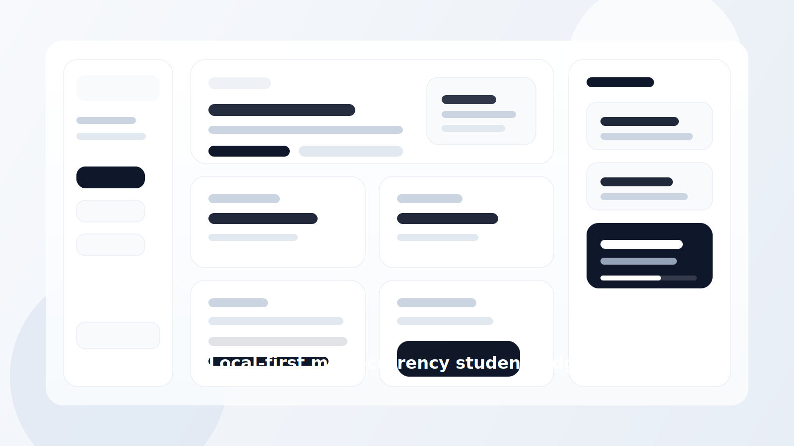

# Personal Ledger Dashboard



A local-first asset dashboard for international students who want one place to track cards, wallets, brokers, and multi-currency balances without connecting bank accounts or uploading private data to a server.

## Why this exists

Most finance tools are built for transaction syncing, categorization, and bank automation.
This project takes the opposite approach:

- no bank sync
- no scraping
- no server-side account storage
- no login
- fast manual balance updates

It is designed for people who only want a clear answer to a few questions:

- How much money do I actually have right now?
- How much of it is in `AUD`, `CNY`, `USD`, `SGD`, `HKD`, or `MYR`?
- Is my monthly cash flow healthy once rent and living costs are counted?

## What is included

- dashboard overview for total assets, account structure, and currency exposure
- portfolio page for concentration and account mix
- budget page for monthly survival planning
- bank card, wallet, and broker detail pages
- multi-currency support for `AUD`, `CNY`, `USD`, `SGD`, `HKD`, and `MYR`
- light mode and dark mode
- first-run onboarding with local starter data

## Starter experience

This repo now opens in a reusable public template, not a personal demo:

- preset bank, wallet, and broker accounts are already there
- all balances start at `0`
- rent, living cost, and fixed income inputs start blank
- users can keep the preset structure or delete what they do not need

After a user edits numbers, everything is stored only in that browser.

## Privacy model

- private data stays in browser `localStorage`
- nothing is uploaded by default
- there is no remote account connection
- there is no server dependency for normal use

## Local development

```bash
npm install
npm run dev
```

Then open [http://127.0.0.1:5173/](http://127.0.0.1:5173/).

## Production build

```bash
npm run build
npm run preview
```

## Tech stack

- React
- TypeScript
- Vite
- Tailwind CSS
- Recharts
- React Router

## Product direction

This is the initial version.
The product focus is:

- fast balance updates
- clear total asset visibility
- multi-currency tracking
- simple monthly survival budgeting

Not included on purpose:

- bank auto-sync
- full transaction import workflow
- advanced portfolio analytics
- tax tooling
